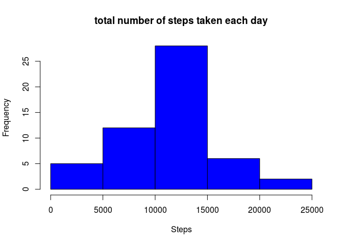
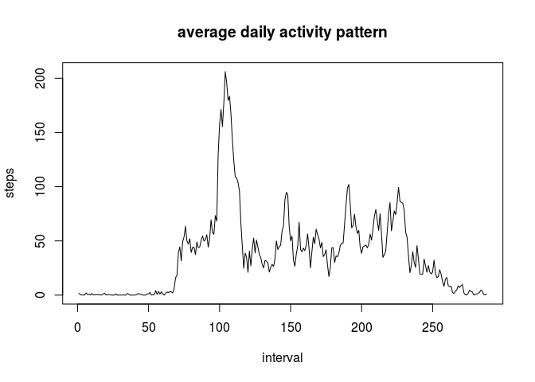
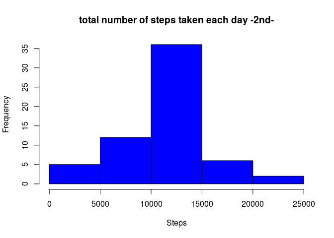
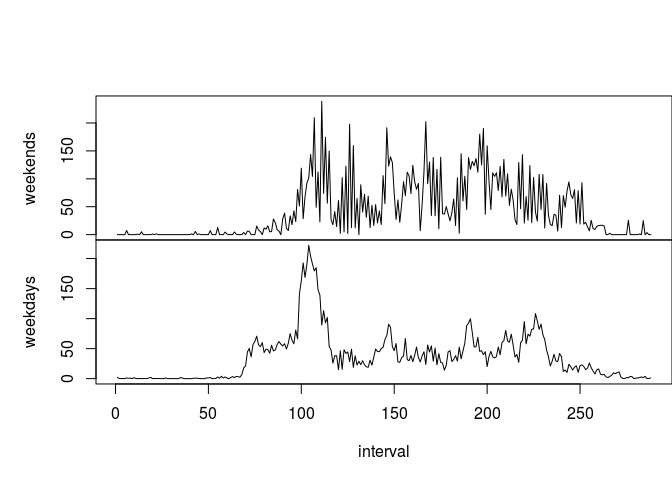

# Reproducible Research: Peer Assessment 1


In order to reproduce correctly this *report* you must clone the [Assignement repository](http://github.com/rdpeng/RepData_PeerAssessment1) and set the right working directory on R.

```bash
## Get the repo
git clone http://github.com/rdpeng/RepData_PeerAssessment1
cd RepData_PeerAssessment1
```

## Loading and preprocessing the data

First we unpack data from zip file and load into `data` var. Then we transform the `data$date` factor in a *date* object.


```r
unzip("activity.zip")
data <- read.csv("activity.csv")
data$date <- as.Date(data$date, "%Y-%m-%d")
```

## What is mean total number of steps taken per day?


- Calculate the total number of steps taken per day
- Make a histogram of the total number of steps taken each day
- Calculate and report the mean and median of the total number of steps taken per day


```r
stepsPerDay <- tapply(data$steps, data$date, sum)
hist(stepsPerDay, main = "total number of steps taken each day",
     xlab = "Steps", ylab = "Frequency", col = "blue")
```

 

```r
meanSteps <- as.integer( mean(stepsPerDay, na.rm = TRUE) )
meanSteps
```

```
## [1] 10766
```

```r
medianSteps <- median(stepsPerDay, na.rm = TRUE)
medianSteps
```

```
## [1] 10765
```

Mean is 10766, median is 10765.

## What is the average daily activity pattern?

- Make a time series plot (i.e. type = "l") of the 5-minute interval (x-axis) and the average number of steps taken, averaged across all days (y-axis)


```r
stepsMeanPerInterval <- tapply(data$steps, data$interval, mean, na.rm = T)
plot(stepsMeanPerInterval, type = "l", main = ("average daily activity pattern"), 
    ylab = "steps",  xlab = "interval")
```

 

- Which 5-minute interval, on average across all the days in the dataset, contains the maximum number of steps?


```r
maxSteps <- which.max(stepsMeanPerInterval)
interval <- names(maxSteps)
interval
```

```
## [1] "835"
```

The 835th interval.

## Imputing missing values

- Calculate and report the total number of missing values in the dataset (i.e. the total number of rows with NAs)


```r
howManyNA <- sum(is.na(data$steps))
howManyNA
```

```
## [1] 2304
```

- Devise a strategy for filling in all of the missing values in the dataset. The strategy does not need to be sophisticated. For example, you could use the mean/median for that day, or the mean for that 5-minute interval, etc.
- Create a new dataset that is equal to the original dataset but with the missing data filled in.


```r
dataD <- data
for (i in 1:nrow(dataD)) {
  if (is.na(dataD$steps[i])) {
    dataD$steps[i] <- mean( dataD$steps[data$interval == dataD$interval[i]] , na.rm=TRUE)
  }
}
```

- Make a histogram of the total number of steps taken each day and Calculate and report the mean and median total number of steps taken per day. Do these values differ from the estimates from the first part of the assignment? What is the impact of imputing missing data on the estimates of the total daily number of steps?


```r
stepsPerDayD <- tapply(dataD$steps, data$date, sum)
hist(stepsPerDayD, main = "total number of steps taken each day -2nd-",
     xlab = "Steps", ylab = "Frequency", col = "blue")
```

 

```r
meanStepsD <- as.integer( mean(stepsPerDayD, na.rm = TRUE) )
meanStepsD
```

```
## [1] 10766
```

```r
medianStepsD <- median(stepsPerDayD, na.rm = TRUE)
medianStepsD
```

```
## [1] 10766
```

strategy come up with:

- Mean before was 10766 now is 10766
- Median before was 10765 now is 10766.19

## Are there differences in activity patterns between weekdays and weekends?

- Create a new factor variable in the dataset with two levels – “weekday” and “weekend” indicating whether a given date is a weekday or weekend day.


```r
data$isWeek<-as.factor(ifelse(weekdays(data$date)==c("sabato","domenica"), 0, 1))
```

- Make a panel plot containing a time series plot (i.e. type = "l") of the 5-minute interval (x-axis) and the average number of steps taken, averaged across all weekday days or weekend days (y-axis). See the README file in the GitHub repository to see an example of what this plot should look like using simulated data.


```r
mweekday <- tapply(data$steps, list(data$interval, data$isWeek), mean, na.rm = T)

par(mfrow = c(2, 1))

with(data, {
    par(mai = c(0, 1, 1, 0))
    plot(mweekday[, 1], type = "l", xaxt = "n", ylab = "weekends")
    par(mai = c(1, 1, 0, 0))
    plot(mweekday[, 2], type = "l", xlab = "interval", ylab = "weekdays")

})
```

 
